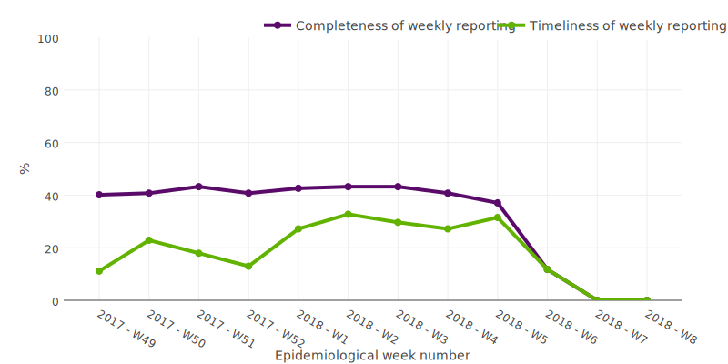
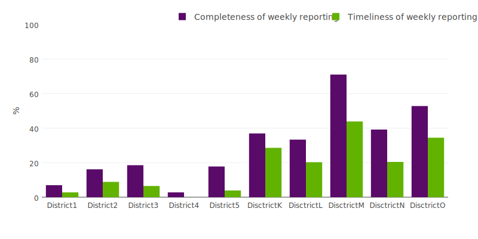
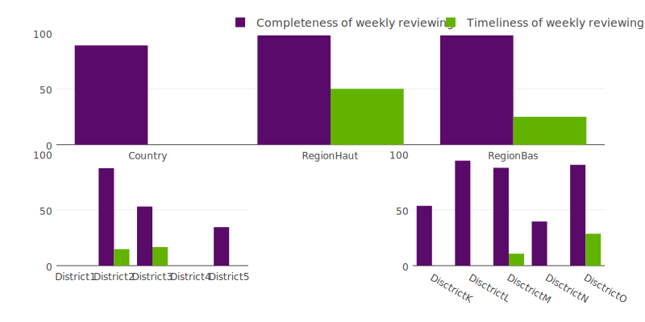

```{r setup, include=FALSE}
library(flexdashboard)
library(shiny.i18n)
source("../constants.R")

## file with translations
i18n <- Translator$new(translation_csvs_path = "../translations",
                       translation_csv_config = "../translations/config.yaml")

## set translation language
i18n$set_translation_language(language)

load("../assets/admin_report.RData")
```

<style>                     
.navbar {
  background-color:#5A0A69;
  border-color:black;
}
</style>

Row
-------------------------------------

### `r i18n$t("country_reporting_header")`




### `r paste(i18n$t("overall_reporting_header"), paste0(min_week, " (", min_year, ")"), paste0(max_week, " (", max_year, ")"))`



Row
-------------------------------------

###  `r paste(i18n$t("overall_review_header"), paste0(min_week, " (", min_year, ")"), paste0(max_week, " (", max_year, ")"))`



<script type="text/javascript">
(function() {
    var randomValue = Math.floor((Math.random() * 1000000) + 1);
    var images = document.getElementsByTagName("img");
    for (index in images) {
        var image = images[index];
        image.src = image.src + "?cacheResetValue=" + randomValue;
    }
})()
</script>

Row
-------------------------------------

### `r i18n$t("silent_sites_8_weeks_header")`

```{r}
DT::datatable(data = sites_no_report_8weeks,
          options = list(dom = 'tp'))
```

### `r i18n$t("silent_sites_3_weeks_header")`

```{r}
DT::datatable(data = sites_no_report_3weeks,
          options = list(dom = 'tp'))
```
