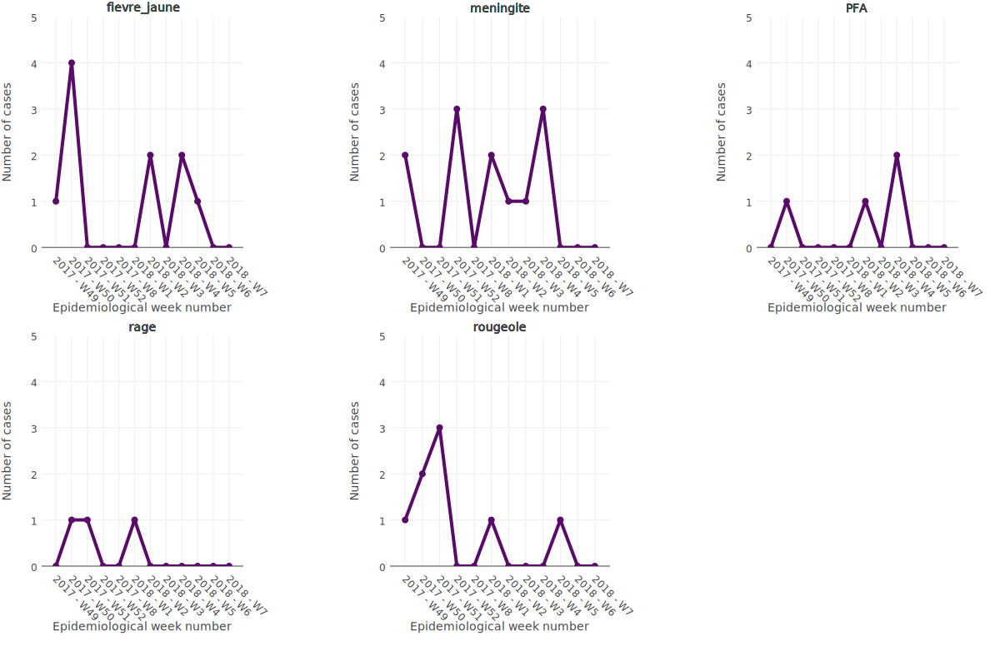
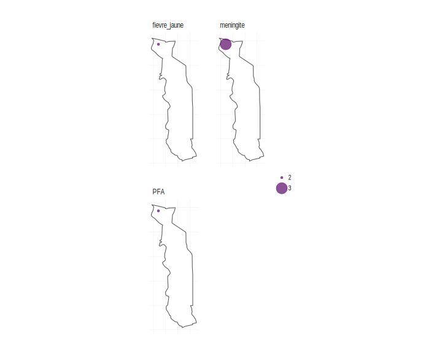

```{r setup, include=FALSE}
library(flexdashboard)
library(shiny.i18n)

## file with translations
i18n <- Translator$new(translation_csvs_path = "../translations")

## set translation language
i18n$set_translation_language("en")

load("../assets/epi_report.Rdata")
```

<style>                     
.navbar {
  background-color:#5A0A69;
  border-color:black;
}
</style>

Row {data-height=650}
-------------------------------------

### `r i18n$t("disease_charts_header")`




### `r i18n$t("disease_maps_header")`



<script type="text/javascript">
(function() {
    var randomValue = Math.floor((Math.random() * 1000000) + 1);
    var images = document.getElementsByTagName("img");
    for (index in images) {
        var image = images[index];
        image.src = image.src + "?cacheResetValue=" + randomValue;
    }
})()
</script>


Row
-------------------------------------

### `r i18n$t("disease_table_occurence_header")`

```{r}
DT::datatable(data = disease_occurance_above_threshold,
          options = list(dom = 'tp'))
```

### `r i18n$t("disease_table_alerts_header")`
```{r}
DT::datatable(data = alert_list_D10,
          options = list(dom = 'tp'))
```

Row
-------------------------------------

### `r i18n$t("disease_table_cumulative_header")`

```{r}
DT::datatable(data = cumulative_table,
          options = list(dom = 'tp'))
```
